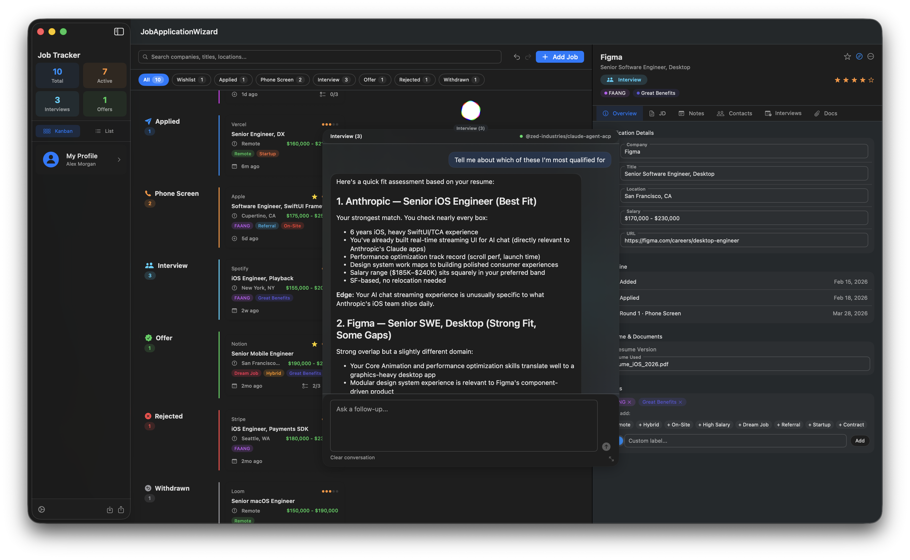

# Job Application Wizard

A native macOS app for managing your job search: track applications on a Kanban board, save job descriptions before they disappear, sync interviews with your calendar, and get AI-powered career coaching through Cuttle, a context-aware floating assistant.

  



---

## Features

### Job Posting Import
Paste in a job posting URL and it pulls the title, company, salary, location, and requirements automatically into a kanban and a table view. Pipeline stages, notes per application, company profiles. It detects ATS systems like Greenhouse and Lever and hits their APIs directly. Falls back to scraping when needed, with Claude filling the gaps.

### Kanban Board & List View
Pipeline across all stages: Wishlist, Applied, Phone Screen, Interview, Offer, Rejected, Withdrawn. Toggle between a Kanban board and a sortable List view at any time. The List view supports column sorting by company, excitement, status, location, salary, and date added. A status filter bar lets you narrow to a single stage; in Kanban mode, filtering shows only that column.

### Job Detail
Each application has a full detail panel with tabbed sections:

- **Overview** — company, title, location, salary, URL, timeline, resume version, color-coded labels, excitement rating (1–5), favorite flag, and per-status subtask checklist
- **Description** — full-text job description storage (paste it before the posting disappears); print, save PDF, or copy to clipboard
- **Notes** — multi-card note system with title, subtitle, tags, and body in a responsive grid
- **Contacts** — track recruiters, hiring managers, and referrals with name, title, email, LinkedIn, notes, and connected status
- **Interviews** — log each round with type, date, interviewers, notes, completion status, and linked calendar events with countdown badges
- **Documents** — attach and manage files per application

### Cuttle: AI Assistant
Cuttle is a free-floating, draggable AI assistant that docks to any panel in the app. It replaces the traditional side panel with a context-aware blob that knows what you're looking at: a specific job, a pipeline stage, or the whole board. Cuttle renders markdown in chat bubbles and maintains separate conversation histories per context.

**Two provider options:**

| Provider | How it works |
|---|---|
| **ACP Agent** (default) | Connect to any [Agent Client Protocol](https://agentclientprotocol.com)-compatible agent; Claude, Goose, Copilot, and more. Agents are discovered from a public registry and launched as local subprocesses. No API key needed. |
| **Claude API** | Direct Anthropic API integration. Requires your own API key (stored in the system Keychain). Shows token usage and estimated cost per response. |

**Quick-start modes** (pre-populated prompts):
| Mode | What it does |
|---|---|
| Chat | Open-ended conversation about the application |
| Tailor Resume | Keyword-matched bullet suggestions against the JD |
| Cover Letter | Tailored 3–4 paragraph cover letter |
| Interview Prep | Behavioral and technical questions with STAR-framework answers |
| Analyze Fit | Fit score and gap analysis against the job description |

Cuttle has full control over job application data: it can update fields, add notes, log contacts, and modify status autonomously based on your conversation. All AI-driven changes are tracked through the reversible history system, so anything Cuttle does can be reviewed and undone.

### Calendar Integration
Link interview rounds to macOS Calendar events. The app syncs on activate, detects rescheduled or deleted events, and shows interview countdown badges on both Kanban cards and List rows.

### History & Undo
A time-travel system tracks all changes (manual and AI-driven) as reversible events. Field updates, status changes, note edits, contact modifications, and document operations can all be undone.

### Design System
A semantic token layer (colors, typography, spacing, radii, shadows, materials) drives all views. Glass surfaces, iridescent sheen on Cuttle-docked panels, outlined fields with floating labels, and consistent button styles (pill, ghost, action) give the app a cohesive visual language. A standalone DesignSystemShowcase app lets contributors preview every component.

### My Profile
A personal profile (accessible from the sidebar) feeds context into every AI request:

- Name, current title, location, LinkedIn, website
- Summary, target roles, skills, preferred salary, work preference
- Full resume text and cover letter template

When profile fields are populated, the AI sees structured candidate context alongside the job description, making tailored output significantly more accurate.

### Settings (⌘,)
A four-tab settings panel:

- **General** — default launch view (Kanban or List), persisted across launches
- **AI Provider** — choose between ACP Agent or Claude API; for ACP, browse the agent registry, select an agent, and connect/disconnect with a status indicator; for Claude API, enter your API key (stored in the system Keychain, never on disk)
- **Data** — export all applications to CSV, import from CSV (merges by ID), full JSON backup and restore, or reset all data
- **About** — app version with Sparkle auto-update support

### Other
- **Labels** — tag applications with preset or custom color-coded labels (Remote, Hybrid, Dream Job, Referral, FAANG, etc.)
- **Favorites & Excitement** — star favorites and rate excitement 1–5 for quick prioritization
- **Subtasks** — per-status checklist items on each application
- **CSV Import/Export** — round-trip your data at any time; you always own it
- **JSON Backup/Restore** — full application data backup and restore
- **PDF Export** — generate a clean PDF of any job description
- **Persistence** — applications and settings saved to JSON in `~/Library/Application Support`; API key stored in the system Keychain

---

## Requirements

- macOS 14 (Sonoma) or later
- For **ACP Agent** mode: Node.js (for npx-based agents) or a compatible binary agent installed locally
- For **Claude API** mode: a [Claude API key](https://console.anthropic.com/)
- AI features are optional; all other features work without any provider configured

---

## Installation

### Download
Grab the latest DMG from the [Releases](https://github.com/zacspa/JobApplicationWizard/releases) page; it's signed and notarized. The app checks for updates automatically via Sparkle.

### Build from source (Xcode)
The easiest way to build from source; macros are enabled via a one-time trust prompt.

```bash
git clone https://github.com/zacspa/JobApplicationWizard
cd JobApplicationWizard
open Package.swift
```

Xcode will ask you to trust the Swift macro targets from TCA; click **Trust & Enable**. Then build and run (⌘R).

### Build from source (command line)
Requires Xcode command-line tools. This project uses TCA's Swift macro plugins, which
need the `--disable-sandbox` flag when building outside Xcode (without it the macro
plugins may crash the compiler or fail to build).

```bash
git clone https://github.com/zacspa/JobApplicationWizard
cd JobApplicationWizard
swift build -c release --disable-sandbox
```

To run the built binary as an `.app` bundle (needed for windowing, Sparkle updates, etc.),
use the included `build_dmg.sh` script or assemble manually:

```bash
APP="JobApplicationWizard.app"
mkdir -p "$APP/Contents/MacOS" "$APP/Contents/Resources" "$APP/Contents/Frameworks"
cp .build/release/JobApplicationWizard "$APP/Contents/MacOS/"
cp -r .build/release/Sparkle.framework "$APP/Contents/Frameworks/"
# You'll also need an Info.plist — see build_dmg.sh for the full template
open "$APP"
```

---

## Setup

1. Launch the app; an onboarding screen walks you through the main features
2. Open **Settings** (⌘,) → **AI Provider**
   - **ACP Agent** (default): click **Refresh** to load the agent registry, select an agent (e.g. Claude Agent), and click **Connect**. First-time npx agents may take a moment to download.
   - **Claude API**: switch to Claude API and paste your Anthropic API key. The key is stored securely in the macOS Keychain and never leaves your machine except for direct calls to the Anthropic API.
3. Click **My Profile** in the sidebar to add your resume and background (optional, but improves AI output significantly)
4. Press **⌘N** or click **Add Job** to add your first application

---

## Architecture

Built with [The Composable Architecture (TCA)](https://github.com/pointfreeco/swift-composable-architecture) by Point-Free.

```
Sources/
├── JobApplicationWizard/
│   └── App.swift                              # SwiftUI App entry, window scenes
├── DesignSystemShowcase/
│   ├── ShowcaseApp.swift                      # Standalone DS preview app
│   └── ShowcaseSections.swift                 # Component gallery sections
└── JobApplicationWizardCore/
    ├── Models.swift                           # JobApplication, JobStatus, JobLabel,
    │                                          #   Contact, InterviewRound, Note,
    │                                          #   SubTask, JobDocument, UserProfile,
    │                                          #   AppSettings, AIProvider,
    │                                          #   ACPConnectionState, ChatMessage
    ├── DesignSystem/
    │   ├── DS.swift                           # Token namespace
    │   ├── DSColor.swift, DSTypography.swift  # Color and type tokens
    │   ├── DSSpacing.swift, DSRadius.swift    # Spacing and radius scales
    │   ├── DSShadow.swift, DSMaterial.swift   # Shadow and material tokens
    │   ├── DSAccent.swift                     # Lane accent colors
    │   ├── PillButtonStyle.swift              # Filter pill buttons
    │   ├── GhostButtonStyle.swift             # Undo/redo ghost buttons
    │   ├── DSActionButtonStyle.swift          # Primary action buttons
    │   ├── GlassSurfaceModifier.swift         # Glass panel backgrounds
    │   ├── IridescentSheenModifier.swift      # Cuttle dock sheen effect
    │   ├── CardModifier.swift                 # Job card styling
    │   ├── DSTextField.swift                  # AppKit-backed text field
    │   ├── DSDateField.swift                  # Optional date picker
    │   ├── DSTextEditorStyle.swift            # Outlined text editor
    │   └── ...                                # Section headers, detail rows,
    │                                          #   action bars, inline fields
    ├── Features/
    │   ├── App/AppFeature.swift               # Root reducer: job list, search,
    │   │                                      #   filter, settings, ACP lifecycle
    │   ├── AddJob/AddJobFeature.swift         # Add job form reducer
    │   ├── JobDetail/JobDetailFeature.swift   # Detail reducer: all tabs, AI chat,
    │   │                                      #   PDF actions, calendar linking
    │   ├── Calendar/
    │   │   ├── CalendarFeature.swift          # Calendar sync reducer
    │   │   └── CalendarSyncModels.swift       # Sync state and event models
    │   ├── Cuttle/
    │   │   ├── CuttleFeature.swift            # Cuttle reducer: dock, chat, mood
    │   │   ├── CuttleContext.swift            # Scoping: global, status, job
    │   │   ├── CuttlePromptBuilder.swift      # Context-aware system prompts
    │   │   ├── AgentActionParser.swift        # Parse AI-suggested changes
    │   │   └── TextActionExtractor.swift      # Extract actions from responses
    │   └── History/
    │       ├── HistoryFeature.swift           # Undo/redo reducer
    │       ├── HistoryEvent.swift             # Reversible event types
    │       └── HistoryTimelineView.swift      # Visual timeline of changes
    ├── ACP/
    │   └── ACPRegistryClient.swift            # Agent registry fetch and types
    ├── Dependencies/
    │   ├── ACPClient.swift                    # ACP subprocess lifecycle, transport,
    │   │                                      #   JSON-RPC handshake, prompt/response
    │   ├── CalendarClient.swift               # EKEventStore integration
    │   ├── ClaudeClient.swift                 # Anthropic API: multi-turn chat
    │   ├── DocumentClient.swift               # File attachment management
    │   ├── HistoryClient.swift                # History persistence
    │   ├── PersistenceClient.swift            # JSON load/save, CSV import/export,
    │   │                                      #   JSON backup/restore
    │   ├── PDFClient.swift                    # NSPrintOperation, PDF generation
    │   └── KeychainClient.swift               # Secure API key storage
    ├── ContentView.swift                      # Root layout (NavigationSplitView),
    │                                          #   StatusFilterBar, onboarding sheet
    ├── SidebarView.swift                      # Stats, view mode toggle, profile card
    ├── KanbanView.swift                       # Kanban board (respects status filter)
    ├── ListView.swift                         # Sortable table with column headers
    ├── JobDetailView.swift                    # Detail panel, all tab views, chat UI
    ├── AddJobView.swift                       # Add job form (separate window)
    ├── CuttleView.swift                       # Floating AI blob: drag, dock, expand
    ├── ProfileView.swift                      # User profile editor sheet
    ├── SettingsView.swift                     # 4-tab settings panel
    ├── Views/
    │   └── CalendarEventPickerView.swift      # Event search and day grouping
    └── Components/
        ├── ChatComponents.swift               # Reusable chat bubble UI
        ├── DebugMenu.swift                    # Debug panel (⇧⌘D, DEBUG builds)
        ├── JitterCircle.swift                 # Animated Cuttle mood indicator
        └── ThinkingBubble.swift               # Animated AI thinking indicator
```

**Key TCA patterns used:**
- `BindingReducer()` + flat state for all form fields (avoids NavigationSplitView first-responder issues on macOS)
- `@Dependency` for all external clients (ACP, Calendar, Claude, Document, History, PDF, Keychain, Persistence)
- `@Shared(.inMemory)` for ACP connection state shared across features (no manual passthrough)
- `.cancellable(id:cancelInFlight:true)` on AI requests to prevent races
- Delegate actions for cross-feature communication (`jobUpdated`, `jobDeleted`)
- `ifLet` scoping for the optional job detail child reducer

---

## License

GPLv3
